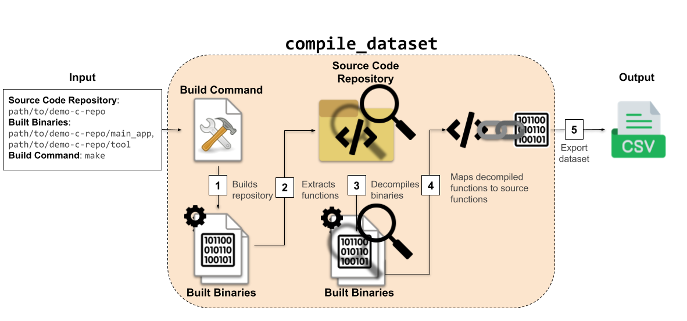

# 2. Quickstart

In this quickstart, we'll show how to use [`compile_dataset`](../../../documentation/codablellm/#codablellm.compile_dataset) to create a [`DecompiledCodeDataset`](../../../documentation/codablellm/dataset/#codablellm.dataset.DecompiledCodeDataset) from a sample C repository.

## Prerequisites

Before getting started, make sure you have the following installed:

- **Python 3.8+**
- **gcc** (for compiling C binaries)
- **make** (to build the example repository)
- **[Ghidra](https://github.com/NationalSecurityAgency/ghidra)** (to decompile the built binaries)

## Step 1: Download and decompress the example repository

Download the provided [example C repository](https://github.com/dmanuel64/codablellm/raw/refs/heads/main/examples/demo-c-repo.zip), then decompress it.

## Step 2: Create the dataset

Use [`compile_dataset`](../../../documentation/codablellm/#codablellm.compile_dataset) to build the repository, extract functions from the source code and binaries, and organize them into a structured dataset:

```python
import codablellm

dataset = codablellm.compile_dataset(
    'path/to/demo-c-repo',              # Path to the repository
    [
        'path/to/demo-c-repo/main_app',
        'path/to/demo-c-repo/tool',
    ],                                  # Binaries that will be built and decompiled
    'make',                             # Command/script path used to build the repository
)
```

When [`compile_dataset`](../../../documentation/codablellm/#codablellm.compile_dataset) is called, `codablellm` first executes the build command (`make` in this case) to build the binaries of the repository (`path/to/demo-c-repo/main_app` and `path/to/demo-c-repo/tool`). Then, it extracts functions from both the source code and the built binaries (using Ghidra to decompile the binaries). These functions are compared and mapped, creating a [`DecompiledCodeDataset`](../../../documentation/codablellm/dataset/#codablellm.dataset.DecompiledCodeDataset). This dataset allows you to see decompiled functions alongside their potential corresponding source code functions, offering a bridge between low-level and high-level representations.

## Step 3: Export the dataset to a CSV

Finally, export your dataset into a CSV file. For more export formats, see [`Dataset.save_as`](../../../documentation/codablellm/dataset/#codablellm.dataset.Dataset.save_as):

```python
dataset.save_as('./demo-c-repo-dataset.csv')
```

## Visual Overview



## Final note

This quickstart provides a minimal working example of how codablellm can create datasets from a simple C project. In the following sections, we'll dive deeper into:

- How to generate source code datasets
- How to generate decompiled code datasets from already compiled binaries
- How to manage and customize source code function extraction
- How to control and customize build processes
- How to configure and manage decompilers